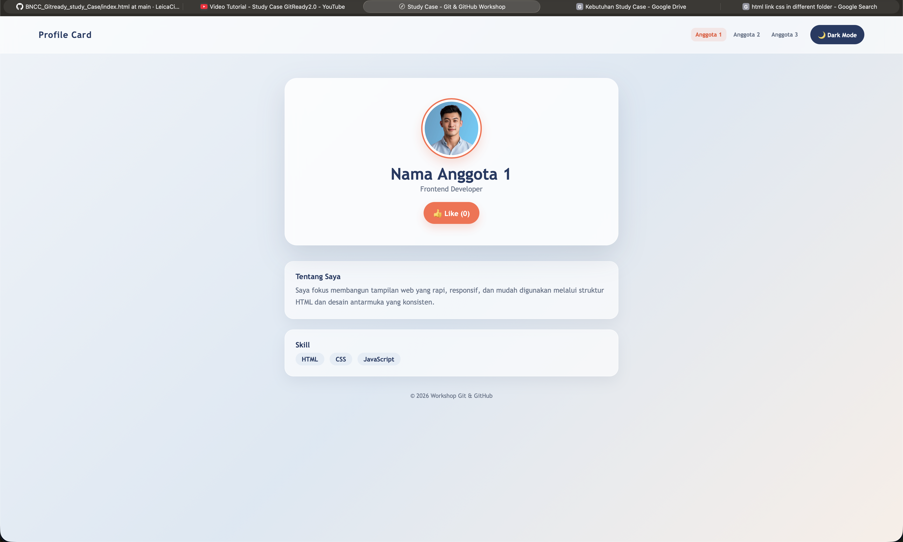

# Overview

Project Developer Website ini merupakan tempat untuk dapat mengenal developer yang membangun website ini dan juga dapat berkenalan dengan para developer

---

## Visualisasi



Live Demo: [link-demo-jika-ada](#)

---

## Tech Stack

- HTML5
- CSS3
- JavaScript (Vanilla)
- Git & GitHub

---

## Fitur Utama

- [ ] Toggle Dark Mode
- [ ] Like Counter interaktif
- [ ] Responsive layout
- [ ] _(tambahkan fitur lain sesuai pengembangan kelompok)_

---


## Contribution

| Jokowi Muda | Role | Kontribusi |
|---|---|---|
| Melvin | Project Initiator | Membuat repository, mengatur akses kolaborator, commit `index.html` |
| Ellena | Styling Engineer | Membuat branch `styling`, menambahkan & menghubungkan `style.css` |
| Jennifer | Script Engineer | Membuat branch `scripting`, menambahkan & menghubungkan `script.js` |

---

## How to Run

1. Clone repository ini:
   ```bash
   git clone <https://github.com/LeicaCielle/BNCC_Gitready_study_Case.git>
   ```
2. Buka folder hasil clone, lalu klik dua kali file `index.html` (atau klik kanan → Open with → Browser).

## Feature Improvement

Ide pengembangan lanjutan jika project ini dilanjutkan, misalnya:

- Menyimpan status like counter ke `localStorage`
- Menambahkan animasi transisi
- Membuat halaman menjadi responsive penuh untuk mobile
- Deploy otomatis via GitHub Actions ke GitHub Pages

